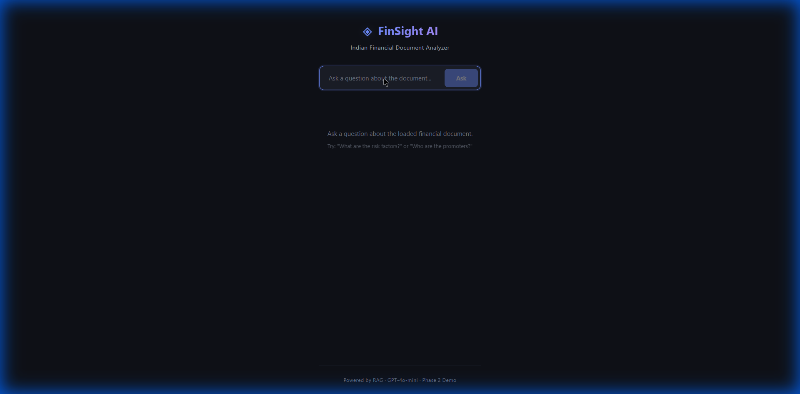

# Cognifin (FinSight AI)

RAG-based question answering over Indian financial documents (NIFTY 50 annual reports, SEBI DRHP/RHP). Ask a natural-language question, get an LLM answer grounded in cited evidence from the source PDFs.



## Stack

- **Backend:** FastAPI, PyMuPDF, sentence-transformers, FAISS, OpenAI
- **Frontend:** React + Vite

## Structure

```
backend/   FastAPI API, ingestion, retrieval pipeline, query understanding
frontend/  React UI (question box, answer, evidence list)
```

## Setup

### Backend

```bash
cd backend
python -m venv venv
venv\Scripts\activate          # Mac/Linux: source venv/bin/activate
pip install -r requirements.txt
cp .env.example .env           # then set OPENAI_API_KEY
uvicorn main:app --reload      # http://localhost:8000/docs
```

### Ingest documents

PDFs are not committed. Place them at `backend/data/<SYMBOL>/<YEAR>.pdf`, then:

```bash
python batch_ingest_annual_reports.py
```

The FAISS index is cached in `backend/index_cache/` (git-ignored). You can also upload a PDF at runtime via `POST /upload`.

### Frontend

```bash
cd frontend
npm install
npm run dev                    # http://localhost:5173
```

The frontend calls the API at `http://localhost:8000` (see `frontend/src/api.js`).

## API

| Method | Path        | Purpose                        |
|--------|-------------|--------------------------------|
| GET    | `/health`   | Health check                   |
| POST   | `/upload`   | Ingest an uploaded PDF         |
| POST   | `/retrieve` | Retrieve evidence only         |
| POST   | `/chat`     | Retrieve + generate answer     |

## Configuration

See `backend/.env.example` (`OPENAI_API_KEY`, `OPENAI_MODEL`, `EMBEDDING_MODEL`, `CHUNK_SIZE`, `CHUNK_OVERLAP`, `TOP_K`, `INDEX_CACHE_DIR`). Never commit `.env`.

## Tests

```bash
cd backend
python -m pytest
```
